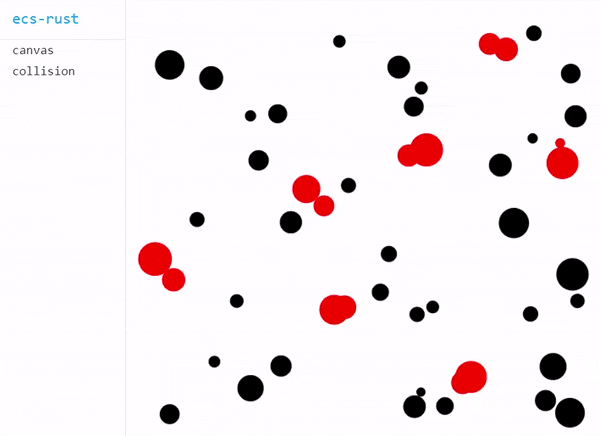

# ecs-rust

[](https://travis-ci.org/takahirox/ecs-rust)
[](https://crates.io/crates/ecs_rust)

`ecu-rust` is a tiny toy [ECS (Entity Component System)](https://en.wikipedia.org/wiki/Entity_component_system) library written in Rust.

## Online demos

[Online WebAssembly demos](https://takahirox.github.io/ecs-rust/web/examples/index.html#canvas)

Rust code is compiled to WebAssembly with [wasm-bindgen](https://rustwasm.github.io/wasm-bindgen/) and it runs even in web browsers.



## Features

* Tiny [ECS](https://en.wikipedia.org/wiki/Entity_component_system) library
* Easy to use
* Memory safe with Rust
* Offers a clean design with [ECS](https://en.wikipedia.org/wiki/Entity_component_system)
* Web application compatible by compiling to WebAssembly

## Documents

T.B.D.

## Sample Code

```Rust
// Import ecs-rust
use ecs_rust::world::World;
use ecs_rust::component::Component;
use ecs_rust::component_manager::ComponentsManager;
use ecs_rust::system::System;

// Define Components and Systems

struct Namable {
  name: &'static str
}

struct Position {
  x: f32,
  y: f32
}

struct Velocity {
  x: f32,
  y: f32
}

struct Step {
  num: u32
}

struct PrintStepSystem;
struct MoveSystem;
struct PrintPositionSystem;

// Implement Components and Systems

impl Component for Namable {}
impl Component for Position {}
impl Component for Velocity {}
impl Component for Step {}

impl System for PrintStepSystem {
  fn update(&mut self, manager: &mut ComponentsManager) {
    let steps = manager.borrow_components_mut::<Step>().unwrap();
    for step in steps.iter_mut() {
      step.num += 1;
      println!("Step {}", step.num);
    }
  }
}

impl System for MoveSystem {
  fn update(&mut self, manager: &mut ComponentsManager) {
    let entity_ids = manager.get_entity_ids_for_pair::<Velocity, Position>();
    for id in entity_ids.iter() {
      let (velocity, mut position) = manager.borrow_component_pair_mut::<Velocity, Position>(*id).unwrap();
      position.x += velocity.x;
      position.y += velocity.y;
    }
  }
}

impl System for PrintPositionSystem {
  fn update(&mut self, manager: &mut ComponentsManager) {
    let entity_ids = manager.get_entity_ids_for_pair::<Namable, Position>();
    for id in entity_ids.iter() {
      let name = manager.borrow_component::<Namable>(*id).unwrap();
      let position = manager.borrow_component::<Position>(*id).unwrap();
      println!("{} is at ({}, {})", name.name, position.x, position.y);
    }
  }
}

// Build an application and Run

fn main() {
  // Create world
  let mut world = World::new();

  // Register Components to world
  world
    .register_component::<Step>()
    .register_component::<Namable>()
    .register_component::<Position>()
    .register_component::<Velocity>();

  // Create Entities and add Components to them
  {
    let entity_id = world.create_entity();
    world.add_component_to_entity(entity_id, Step {num: 0});
  }

  {
    let entity_id = world.create_entity();
    world
      .add_component_to_entity(entity_id, Namable {name: "Alice"})
      .add_component_to_entity(entity_id, Position {x: 0.0, y: 0.0})
      .add_component_to_entity(entity_id, Velocity {x: 1.0, y: 2.0});
  }

  {
    let entity_id = world.create_entity();
    world
      .add_component_to_entity(entity_id, Namable {name: "Bob"})
      .add_component_to_entity(entity_id, Position {x: 0.0, y: 0.0})
      .add_component_to_entity(entity_id, Velocity {x: -2.0, y: 1.0});
  }

  {
    // Unmovable
    let entity_id = world.create_entity();
    world
      .add_component_to_entity(entity_id, Namable {name: "Rock"})
      .add_component_to_entity(entity_id, Position {x: 0.0, y: 0.0});
  }

  // Add Systems to world
  world
    .add_system(PrintStepSystem {})
    .add_system(MoveSystem {})
    .add_system(PrintPositionSystem {});

  // Run
  for _i in 0..3 {
    world.update();
  }
}

/*
 * Result:
 * Step 1
 * Alice is at (1, 2)
 * Bob is at (-2, 1)
 * Rock is at (0, 0)
 * Step 2
 * Alice is at (2, 4)
 * Bob is at (-4, 2)
 * Rock is at (0, 0)
 * Step 3
 * Alice is at (3, 6)
 * Bob is at (-6, 3)
 * Rock is at (0, 0)
 */
```

## How to import

The library is released at [crates.io](https://crates.io/crates/ecs_rust). Add the following line into Cargo.toml of your Rust project.

```
[dependencies]
ecs_rust = "0.0.2"
```

And add the following lines in your Rust code to import the library.

```Rust
use ecs_rust::world::World;
use ecs_rust::component::Component;
use ecs_rust::component_manager::ComponentsManager;
use ecs_rust::system::System;
```

## How to build the library locally

```sh
$ git clone https://github.com/takahirox/ecs-rust.git
$ cd ecs-rust
$ cargo build
```

## How to run desktop examples locally

```sh
$ cd ecs-rust
$ cargo run --example example_name
```

## How to run web examles locally

Prerequirements
- Install [wasm-bindgen client](https://rustwasm.github.io/docs/wasm-bindgen/)
- Install Rust wasm32-unknown-unknown target with `$ rustup target add wasm32-unknown-unknown`
- Install `http-server` with `$ npm install -g http-server`, or other local servers

```sh
$ cd ecs-rust/web
$ bash build_examples.sh
$ http-server . -p 8080 -c-1
# Access http://localhost:8080/examples/index.html on your web browser
```

## How to run tests

T.B.D.
